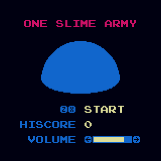
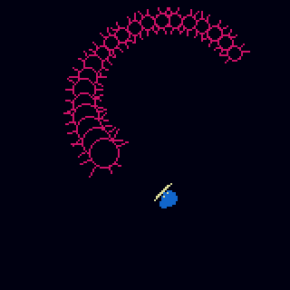

# One Slime Army

An arcade endless wave survival game for the [WASM-4](https://wasm4.org) fantasy console,
[Game Jam #2](https://itch.io/jam/wasm4-v2), written in [Zig](https://ziglang.org/) version 0.9.1






Battle hordes of enemies as a humble slime equipped with his trusty sword and shield.

| Controls    |                       |
| ----------- | --------------------- |
| Arrow keys  | Move                  |
| Z (hold)    | Block, Lock direction |
| Z (release) | Attack                |
| X           | Dash                  |

## Building

Build the cart by running:

```shell
zig build -Drelease-small=true
```

Then run it with:

```shell
w4 run zig-out/lib/cart.wasm
```

For more info about setting up WASM-4, see the [quickstart guide](https://wasm4.org/docs/getting-started/setup?code-lang=zig#quickstart).

## Links

- [Documentation](https://wasm4.org/docs): Learn more about WASM-4.
- [Snake Tutorial](https://wasm4.org/docs/tutorials/snake/goal): Learn how to build a complete game
  with a step-by-step tutorial.
- [GitHub](https://github.com/aduros/wasm4): Submit an issue or PR. Contributions are welcome!
